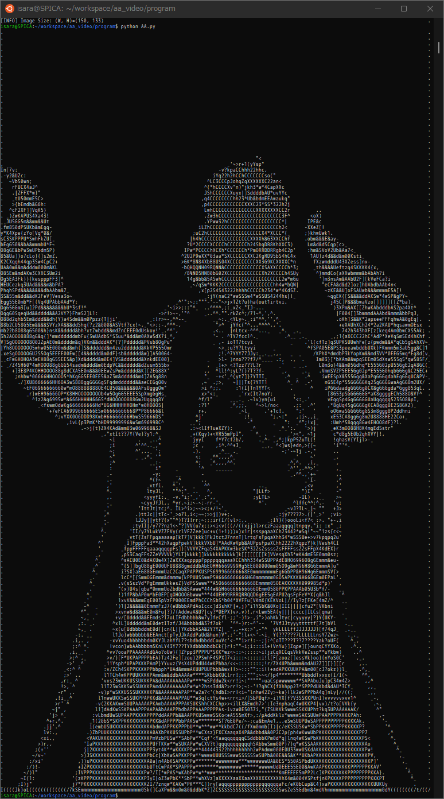

# AA Video on Console
- This is the project to convert video to text video on console. 
- Screen shot:
  - 
- Video:
  - [[ASCII Art] Shortcake SONG | ラプラス・ダークネス（La+ Darkness）](https://www.youtube.com/watch?v=3t8u8A6oqq8)

## Usage
- First
  ```
  $ cd program
  ```
- Help
  ```txt
  $ python main.py -h
  usage: main.py [-h] [--video-path VIDEO_PATH] [--start-over] [--audio-off] [--alpha ALPHA] [--beta BETA]

  optional arguments:
    -h, --help            show this help message and exit
    --video-path VIDEO_PATH, -v VIDEO_PATH
    --start-over, -s
    --audio-off
    --alpha ALPHA
    --beta BETA
  ```
- Run
  - `VIDEO_PATH` is the path to the video which you want to convert.
    ```sh
    $ python main.py --video-path [VIDEO_PATH]
    ```
  - This program plays audio of video by default.
  - If you want to turn off audio, you can run as the following:
    ```sh
    $ python main.py --video-path [VIDEO_PATH] --audio-off
    ```
  - After you execute `main.py`, `image/[VIDEO_FILE_NAME]` and `text/[VIDEO_FILE_NAME]` directories are created in `data` directory.
  - Then, if`image/[VIDEO_FILE_NAME]` and `text/[VIDEO_FILE_NAME]` directories exist, this program skips convert process.
  - So, if you want to convert again, you need to run as the following:
    ```sh
    $ python main.py --video-path [VIDEO_PATH] --start-over
    ```
  - In additon, if you want to change contrast and brightness of images, you can change as the following:
    ```sh
    $ python main.py --video-path [VIDEO_PATH] --start-over --alpha 1.0 --beta 0.0
    ```
    - The images drawn on the console are better suited to high contrast, so `alpha=1.2, beta=0.0` are set as default.

## References
- [Shortcake SONG #shorts](https://www.youtube.com/watch?v=pbZYQDRMs6g)
- [【Python】自動でAA（アスキーアート）を生成してくれる単純なコードを書いた](https://qiita.com/Cartelet/items/542fe3f966b8fa98437a)
- [Python, OpenCVで動画ファイルからフレームを切り出して保存](https://note.nkmk.me/python-opencv-video-to-still-image/)
- [【Python】ターミナル表示で色を付けたい。](https://qiita.com/nanato12/items/5f287f3008135ca4cb03)
